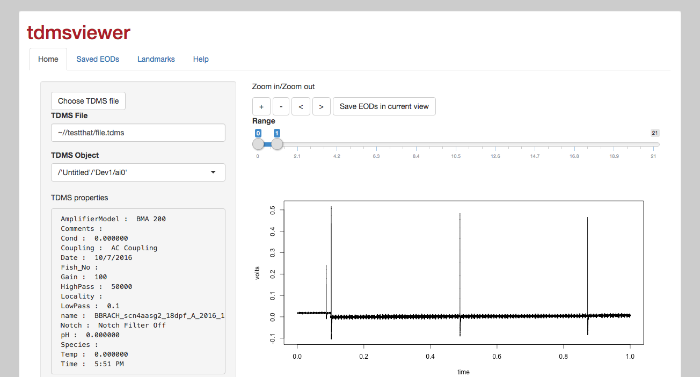

# tdmsviewer

Programs for seeking and analyzing LabVIEW tdms files

## Prerequisites

R packages:

- shiny
- tdmsreader

Note: tdmsreader is not currently an official R package so it is recommended to first install the package `devtools` and then run `devtools::install_github('msuefishlab/tdmsreader')`

## Start server

Execute the command

- Rscript -e 'shiny::runApp()'

Alternatively open the ui.R and server.R files in RStudio and click 'Run app'

## Usage

Navigate to the webpage, and choose a directory that contains TDMS files using the "Directory select" button to load the files in that directory into a dropdown box

To interact with the TDMS data, you can use the following tools

- Use the plus and minus buttons to zoom in and out
- The range slider allows you to select the start and end of the range you want to view
- Click and drag the mouse over the plot of the data itself to zoom in on a region

## Screenshot

