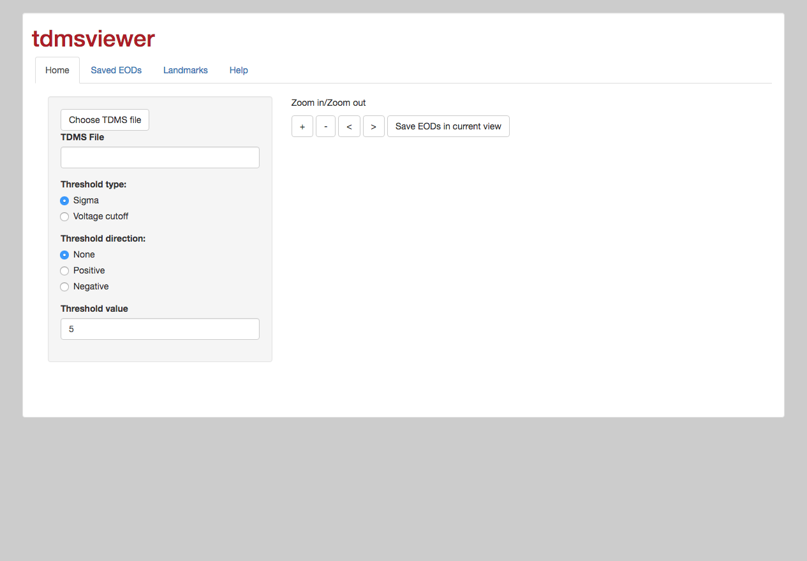
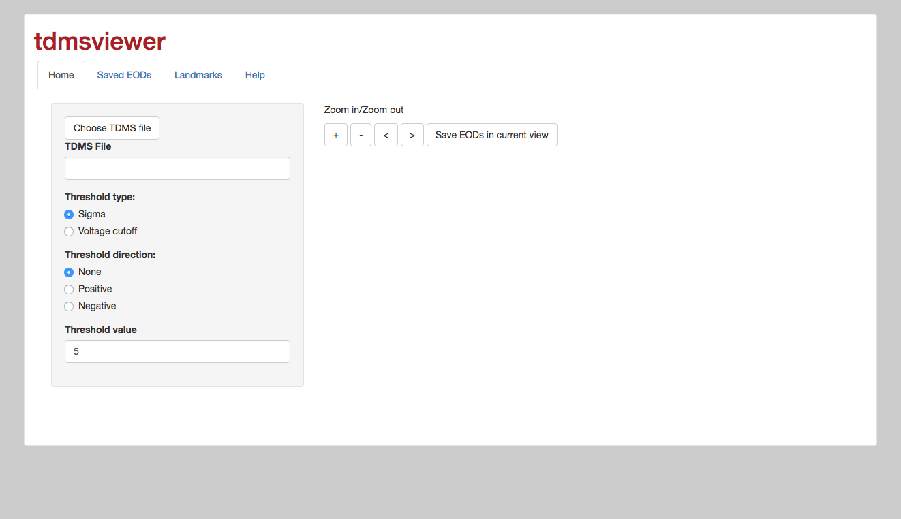
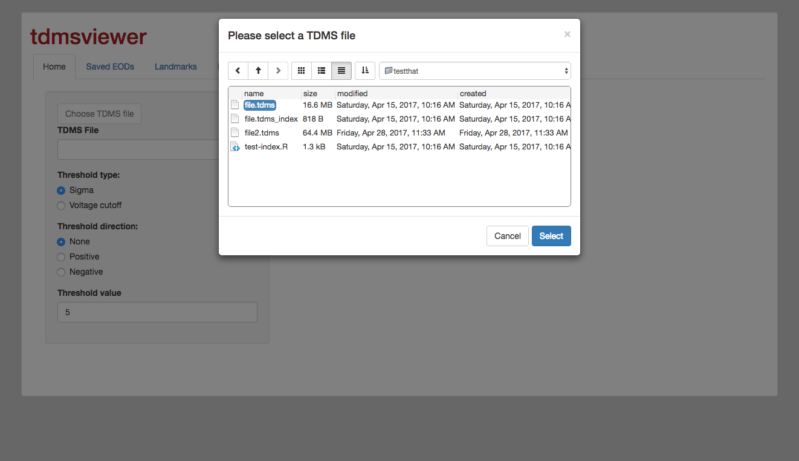
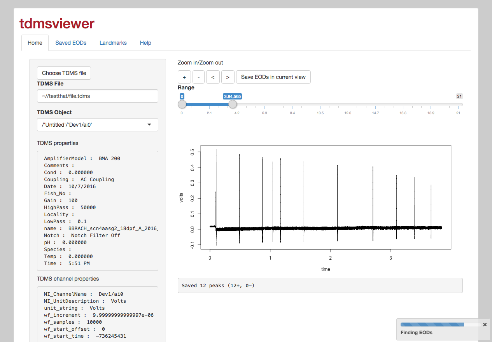
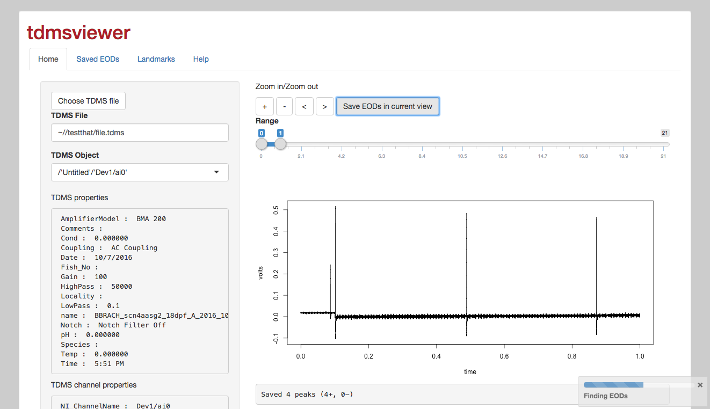
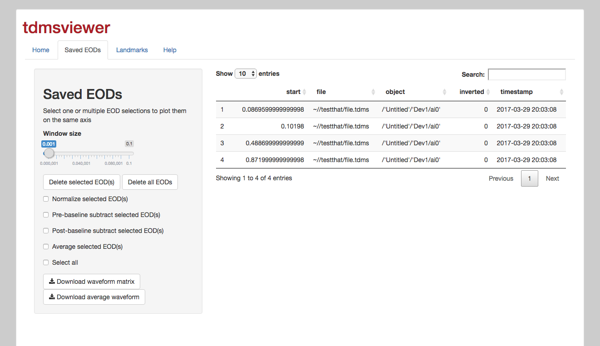
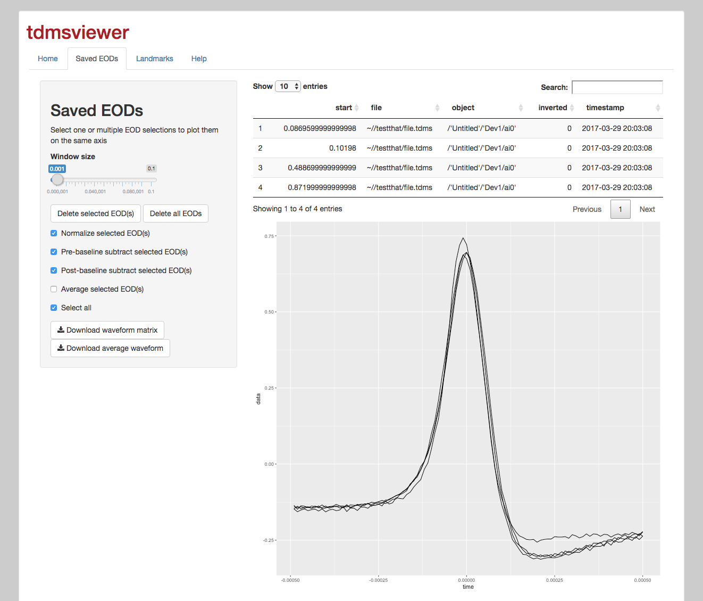
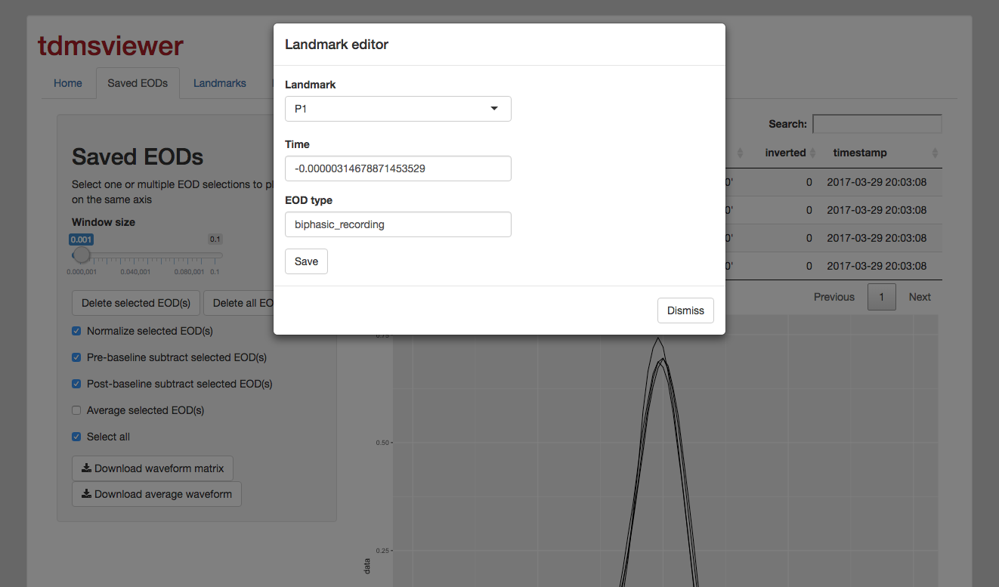
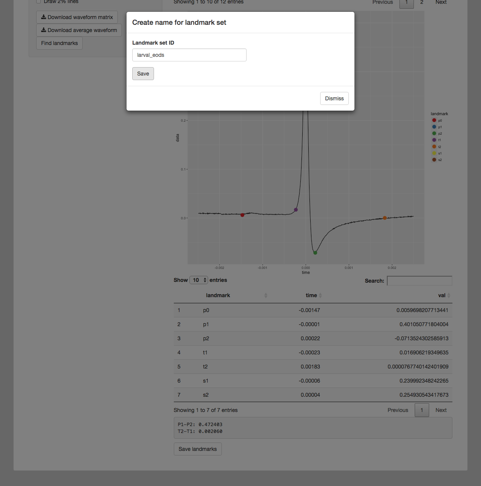
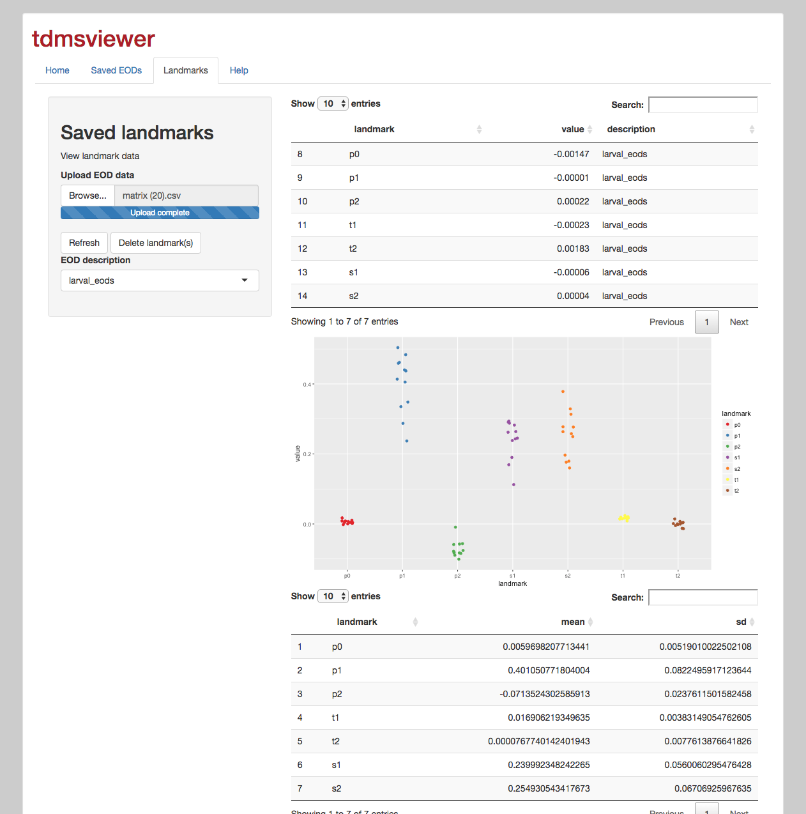

# TDMSViewer User Manual

## Source Code

https://github.com/msuefishlab/tdmsviewer

## Installation

TDMS Viewer is designed as an R package, to be installed using a package
manager. In our case, we install it from github. Open RStudio and run

```{r,eval = FALSE}
install.packages('devtools')
library(devtools)
install_github('msuefishlab/tdmsviewer')
```

After running this it should install the tdmsviewer app and its
dependencies automatically. Windows users please note that some
additional dependencies need to be installed manually.

To make sure you are installing the version mentioned in this guide, you
can also run

```{r,eval = FALSE}
install_github('msuefishlab/tdmsviewer@0.5.0')
```

But you might benefit from using the latest version

### Windows specific installation errors

The install\_github function doesn’t work fully properly on Windows
On Windows, the install\_github function it fails to install some dependencies,
so you may have to install them manually.

Possible dependencies you have to manually install includes

```{r, eval=FALSE}
install.packages(c('htmlwidgets','DT','RSQLite','Rcpp', 'ggplot2'))
```

Note that this is only a problem on windows, other platforms should
install all dependencies automatically when you use
`install_github('msuefishlab/tdmsviewer')`

## Using TDMSViewer

Once the library is installed, you can then use it by running

```{r,eval=FALSE}
library(tdmsviewer)
tdmsviewer()
```

This will launch a browser that you can then use to open your files and
navigate the webapp

Note that you may also want to set the "base directory" of the app to
either broaden or limit the subfolders that the webapp can access.
Simply run instead

```{r,eval=FALSE}
library(tdmsviewer)
tdmsviewer(basedir="C:\\")
```

To run from root C: drive on windows. Or

```{r,eval=FALSE}
library(tdmsviewer)
tdmsviewer(basedir="C:\\Users\\YourName\\Desktop\\FolderWithTDMS")
```

By default the basedir is your home directory when using Linux/MacOS or
the My Documents folder when using Windows

#### Selecting TDMS files

The first thing to do to select TDMS files is to click the "Choose TDMS
file" button. This will launch a file selector, and you will open a
specific directory that contains TDMS files.



Figure 1. "Choose TDMS file" button



Figure 2. The "Choose TDMS file" file selector



Figure 3. After selecting a file, it is automatically plotted over the
range \[0-1\] seconds and metadata is displayed

#### TDMS metadata

-   The "TDMS properties" contains file-level metadata e.g. gain, pH,
    time/date, name, etc.

-   The "TDMS channel properties" contains channel-level metadata e.g.
    sample rate

Most of the files we look at only have one channel, but the "object"
selector lets you see a list of available channels

#### Navigating TDMS files

Once the chart is plotted on the screen, there will be several options

1)  Range: this is the start and stop time to be plotted from the TDMS
    file

2)  Zoom in (+) narrows the start and stop range

3)  Zoom out (-) widens the start and stop range (doesn’t go past 0 or
    end of file)

4)  Move left (&lt;) shifts view to the left

5)  Move right (&gt;) shifts view to the right

You can also click and drag your mouse over the plot itself which
automatically zooms in on a specific area

#### Saving EODs

You can use the "Save EODs in current view" button which will
automatically run a peak finder over the range from start to end.

This peak finder finds data points where the data in this range
is$\text{\ mean}\left( x \right) \pm n*stddev(x)$ where n is user
configurable setting for threshold.

This captures "positive" of "negative" peaks, and after the peak finder
is fixed. The app will output a text that says "Saved N peaks, (x+, y-)"
when complete (Figure 4)



Figure 4. Selecting the "Save EODs in current view" captures EOD peaks
using either the sigma or voltage threshold. A progress bar is displayed
and a text is outputted about the saved peaks

#### Saved EODs

After the EODs are saved using the peak finder, they will be saved to a
SQLite database (which is persistent across sessions) and you will see a
list of EODs on a table



Figure 5. The "Saved EODs" tab shows a list of EOD that were captured by
peak finding, and can display the EODs overlaid on each other



Figure 6. After clicking "Select all" it will plot all waveforms on a
single plot

The following transformations are supported

1)  Normalize selected EOD(s) - clip the maximum to minimum value 0-1

2)  Pre-baseline subtract – subtract mean of 100 samples before
    normalization

3)  Post-baseline subtract – subtract mean of 100 samples after
    normalization

4)  Average selected EOD(s) – collapse all EODs into average waveform

#### Downloading data from Saved EODs page

The app supports downloading the EOD data from the "Saved EODs" page
with two buttons

-   "Download waveform matrix" gets a CSV where columns are volts, rows
    are timepoints

-   "Download average waveform" gets a CSV with one column (volts), rows
    are timepoints

*Important tip about the Saved EOD page:*

You can also use the "search" function to the right of the table to
filter the EODs that you are interested in, and it will only plot the
EODs that match the "search" that you submitted

For example, you can search part of the filename that you saved the EODs
from or similar

#### Finding landmarks on the "Saved EODs" tab

To identify landmarks, you can click the "Find landmarks" button which
will automatically identify the main landmarks



Figure 7. Plot of average waveform before identifying waveforms




Figure 8. Waveform after clicking "Find landmarks" button




Figure 9. Giving a name for your landmarks which is used on the "Landmarks" tab

#### Evaluating landmarks in the "Landmarks" tab

The "Landmarks" tab of the application allows you to view data about the
annotated landmarks for a given set of waveforms.

To get started, first download a set of EODs using the "Download
waveform matrix" in the "Saved EODs" tab, and upload it to the
"Landmark" tab for evaluation.

Then you can choose the set of landmarks (e.g. you might have a set of
landmarks for larval recordings, adult recordings, etc). The result will
be a plot of the voltage values at that particular location, and a
textual output of the mean and stddev of the voltage values



Figure 10. Overview of the "Landmark" plots the voltage value for multiple
EOD waveforms at the annotated points that are given

## Conclusion

The TDMS Viewer offers a streamlined approach to analyzing EOD data. You
can interactively analyze and collect EOD waveforms from different TDMS
files using the application, and the results will be saved into a local
"database" that you can access at a later time. You can also create
custom plots of the waveforms, download waveforms, annotate the
waveforms with landmarks, and get statistics.
